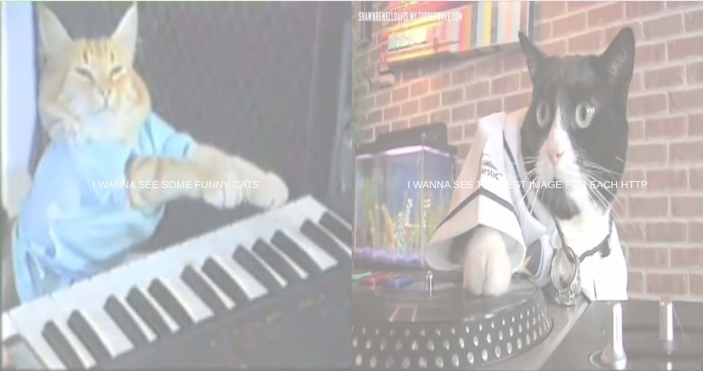

<h1 align="center">
  
</h1>

<p align="center">
  <b>English</b> · <a href="README.pt-BR.md">Português</a>
</p>

# Cats

**Live:** https://cats-lyart-tau.vercel.app

> This repository is archived. The app still runs and stays online at the link above.

A small Angular app full of cats. I built it in college as a toy project to learn web development: components, routing, HTTP calls, interceptors and Bootstrap.

## Features

- **Main menu**: two big animated tiles that lead to the other pages.
- **Cat generator**: fetches a random cat photo; you can keep the ones you like and drop the last one you saved. A Nyan Cat spinner plays while requests are in flight (via an HTTP interceptor).
- **HTTP cats**: type an HTTP status code and get the matching [http.cat](https://http.cat) image.
- **Full-screen cats** (`/fullCats`): a wall of 50 random cats.

## Tech

- [Angular](https://angular.dev) 22
- [Bootstrap](https://getbootstrap.com) 5
- [TypeScript](https://www.typescriptlang.org)
- [Vitest](https://vitest.dev) for unit tests

Images come from [TheCatAPI](https://thecatapi.com) and [http.cat](https://http.cat).

## Running

Requires Node.js 22+.

```bash
npm install
npm start        # http://localhost:4200
npm test         # unit tests
npm run build    # production build in dist/cats
```

## History

Originally written in 2019 on Angular 8. In 2026 it was moved to Angular 22, and the random cat API, which had gone offline (aws.random.cat), was replaced with TheCatAPI.
